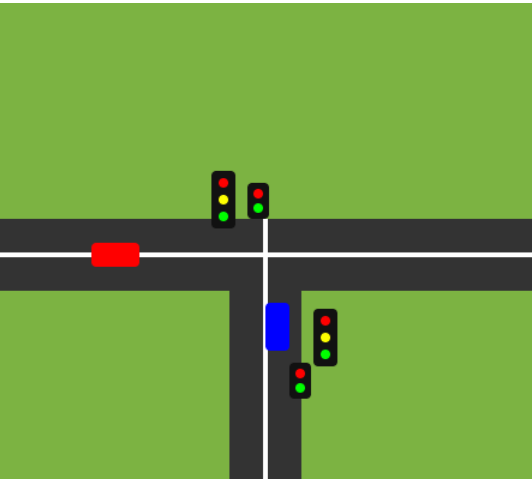
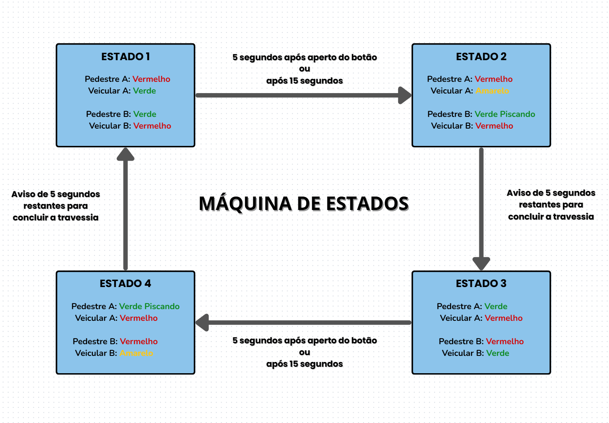

# Trainee-CoreTech

Roteiro de implementação de semáforo.

---

## Documentação Projeto Trainee

**Projeto:** Controlador FPGA – Semáforo com Prioridade de Pedestre e Botão

---

## Participantes

- Eduardo Souza  
- Gustavo Gomes  
- Lucas Santana  
- Mateus Aranha  
- Paulo Medeiros  

---

## Roteiro do projeto

A fim de solucionar o longo tempo de espera descoordenado entre semáforos, foi planejado um projeto de controle funcional de um cruzamento de veículos em T. Os carros na horizontal permanecem na mesma via, enquanto os da vertical, irão realizar uma curva 90° à direita. Dessa forma, os semáforos para veículos nessas duas vias permaneçam necessariamente em estados diferentes, para que seja coordenado a travessia dos transeuntes, de maneira análoga, para cada semáforo veicular, haverá um semáforo de pedestres associado em um estado oposto. De forma que foram definidos 10 segundos como suficiente para travessia, os quais os últimos 5 a luz verde do pedestre irá entrar em um estado de pisca, para alertar o transeunte sobre o tempo restante. Da mesma forma, 5 segundos após o botão solicitar a travessia, haverá 5 segundos de sinal amarelo alertando aos motoristas da parada. Assim se garante uma margem segura o suficiente capaz de evitar-se acidentes.

---

## Planejamento da abordagem

Antes da implementação direta do projeto, analisou-se as diferentes formas de se montar o projeto, com uma placa de controle FPGA, o que resultou na elaboração da seguinte máquina de estados para cada par de semáforo:

---

## Elaboração do projeto

Dessa maneira, elaborou-se o código em verilog que adotaria o nível comportamental de abstração a partir da máquina de estados descrito na imagem.

---

## Concepção Física do Sistema

Ao utilizar um chip de lógica programável (FPGA ep2c35f672c6), nota-se que há um poder computacional muito superior a grande parte dos microcontroladores do mercado, entretanto, nota-se que existe uma série de dificuldades e complexidade intrinsecamente associada ao uso do componente, principalmente quando se trata no uso as pinagens programáveis, GPIO, observa-se que o design mais flexível exige um cuidado maior com o controle de saída de tensão e corrente de cada pino do chip. Dessa forma, faz-se crucial a necessidade de unidades de transistores, que atuam no controle de potência para funcionamento ideal do sistema.

---

## Instruções para funcionamento

O projeto foi confeccionado de forma que, não seja necessário nenhuma documentação verborrágica para entender a capacidade e funcionamento do projeto. De forma que possa ser escalonado futuramente, e aplicado em maior escala, dessa forma poderá alcançar mais públicos sem muitos gargalos do entendimento.

Haverá no projeto físico dois pares de semáforos sinalizadores, que contêm um semáforo de pedestre e o veicular associados a um mesmo botão. Intuitivamente, ao ser pressionado, acionará a sequência de eventos descritos no diagrama de estados na figura 2, a qual é finalizada na mesma condição inicial.

---

## Pontos sensíveis a melhorias

Devido a simplicidade inicial do projeto, desconsiderou-se alguns pontos, como a impossibilidade dos dois semáforos veiculares serem vermelhos simultaneamente, assim como a definição de um tempo muito curto para a travessia hipotética, cujo intuito é puramente lúdico.

---

## Lista de materiais

- Placa de isopor 50x50cm  
- Feltro verde 50x50cm  
- EVA´s de múltiplas cores  
- Esponjas  
- Tintas guache de múltiplas cores  
- Clipes de escritório  
- Massa biscuit  
- Cola de isopor  
- Canudos biodegradáveis grossos  
- 2x LEDs Vermelhos  
- 2x LEDs Amarelos  
- 2x LEDs Verdes  
- 2x Botões  
- Jumpers para conexão de eletrônicos à placa  
- FPGA ep2c35f672c6  
- Múltiplos resistores de 220 Ohm  
- 2x Resistores de 1k Ohm  
